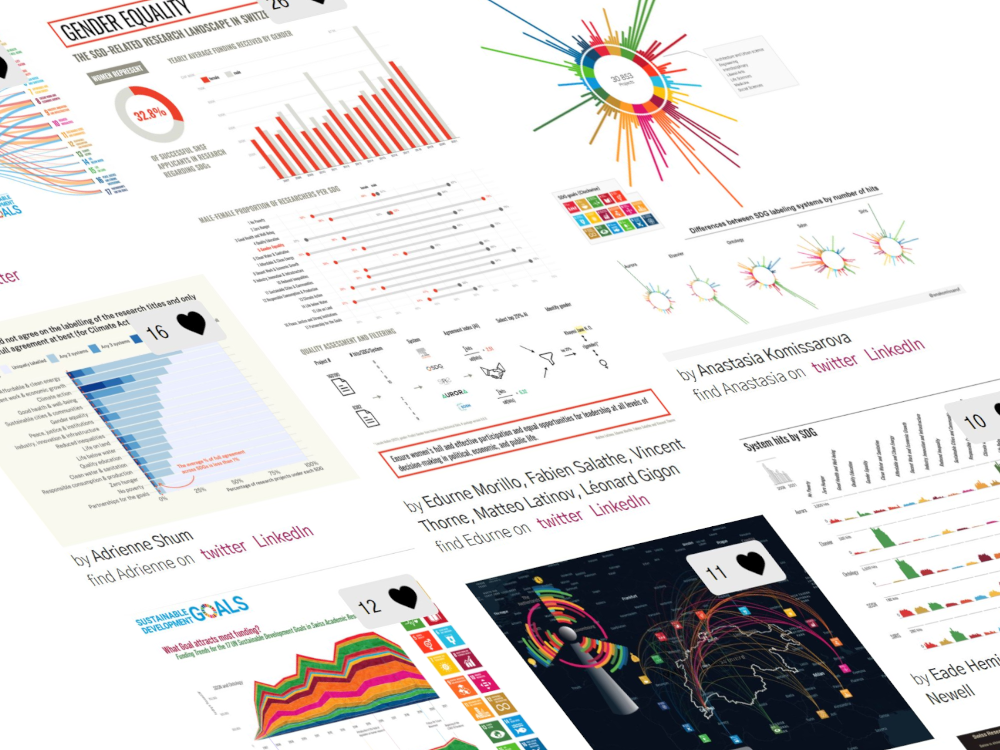

```{r general-setup, include=FALSE}
## This file contains the GERMAN version of the data story

# Set general chunk options
knitr::opts_chunk$set(echo = FALSE, fig.showtext = TRUE, fig.retina = 3, 
                      fig.align = "center", warning = FALSE, message = FALSE)

# Install pacman package if needed
if (!require("pacman")) {
  install.packages("pacman")
  library(pacman)
}

# Install snf.datastory package if not available, otherwise load it
if (!require("snf.datastory")) {
  if (!require("devtools")) {
    install.packages("devtools")
    library(devtools)
  }
  install_github("snsf-data/snf.datastory")
  library(snf.datastory)
}

# Load packages
p_load(tidyverse,
       lubridate,
       scales, 
       conflicted, 
       jsonlite,
       here, 
       ggiraph)

# Conflict preferences
conflict_prefer("filter", "dplyr")
conflict_prefer("get_datastory_theme", "snf.datastory")
conflict_prefer("get_datastory_scheme", "snf.datastory")

# Increase showtext package font resolution
showtext_opts(dpi = 320)

# Set the locale for date formatting (Windows)
Sys.setlocale("LC_TIME", "German")

# Create function to print number with local language-specific format 
print_num <- function(x) snf.datastory::print_num(x, lang = "de")

# Knitr hook for local formatting of printed numbers
knitr::knit_hooks$set(
  inline <- function(x) {
    if (!is.numeric(x)) {
      x
    } else {
      print_num(x)
    }
  }
)
```

```{r print-header-infos, results='asis'}
# Add publication date to header
cat(format(as_datetime(params$publication_date), "%d.%m.%Y"))
```

```{r story-specific-setup, include=FALSE}
# Set story-specific variables etc. here

# E.g. loading data...

```

<!-- Short lead (2-3 sentences) in bold -->

__Die Datensätze über unsere Forschungsförderung sind öffentlich zugänglich. Sie lassen sich vielseitig verwenden: zur Erforschung von Trends in der Wissenschaft ebenso wie für fundierte Themenanalysen – zum Beispiel über Nachhaltigkeit.__

Im November 2021 organisierten <a href="http://www.correlaid.ch/" target="_blank">CorrelAid Switzerland</a> und das <a href="http://cds.unibas.ch/" target="_blank">Center for Cognitive and Decision Sciences (CDS) der Universität Basel</a> einen <a href="https://www.sdghackathon.io/" target="_blank">Hackathon</a>. Das Thema: Schweizer Forschung zu den <a href="https://sdgs.un.org/goals" target="_blank">UNO-Zielen für Nachhaltige Entwicklung (SDG)</a>. Die Teilnehmenden analysierten öffentlich zugängliche Daten des SNF, wie Projekttitel, Keywords, Abstracts und Disziplinen der einzelnen Beiträge sowie einfache demografische Daten über die Beitragsempfängerinnen und -empfänger. Danach erstellten sie Datenvisualisierungen, um einzelne Aspekte der Nachhaltigkeitsforschung zu illustrieren.


Der Jurypreis ging an eine Visualisierung, die zeigt, mit welchem Prozentanteil Forscherinnen zu den einzelnen Nachhaltigkeitszielen beitragen. Mit dem Publikumspreis wurde eine Visualisierung zur Verteilung der Projekbeiträge auf die drei Förderbereiche des SNF und die grössten Hochschulen der Schweiz ausgezeichnet. Alle Visualisierungen sind <a href="https://www.sdghackathon.io/hackathon-visualizations" target="_blank">hier</a> einsehbar. 

Auf dem Datenportal des SNF stehen verschiedene <a href="https://data.snf.ch/datasets" target="_blank">Datensätze</a> zum Download zur Verfügung, namentlich Abstracts der Forschungsprojekte, Fachpublikationen und anwendungsorientierte Forschungsergebnisse. Wer interessante Erkenntnisse aus den SNF-Daten gewinnt, kann sich gern bei uns melden. Wir würden uns sehr darüber freuen. 

<div class="plot-box">

<div class="hide-mobile hide-tablet" style="width: 800px;position: relative;max-width: 800px;left: -70px;border-top: 1px solid #d3d3d3;border-bottom: 1px solid #d3d3d3;padding-top: 20px;margin: 20px 0;">

<div class="plot-title">Beispiele aus den eingereichten Visualisierungen des Hackathon: Visualisierungen zur Schweizer Nachhaltigkeitsforschung</div>

```{r hackathon-gallery-desktop, out.width="100%", fig.height=6}

```

<div class="caption">
Visualisierungen zur Schweizer Nachhaltigkeitsforschung auf der Basis von allgemein zugänglichen Daten des SNF. Alle Visualisierungen sind <a href="https://www.sdghackathon.io/hackathon-visualizations" target="_blank">hier einsehbar</a>.
</div>

</div>

<div class="hide-desktop">

<div class="plot-title">Beispiele aus den eingereichten Visualisierungen des Hackathon: Visualisierungen zur Schweizer Nachhaltigkeitsforschung</div>


```{r hackathon-gallery-mobile, out.width="100%", fig.height=6}

```

<div class="caption">
Visualisierungen zur Schweizer Nachhaltigkeitsforschung auf der Basis von allgemein zugänglichen Daten des SNF. Alle Visualisierungen sind <a href="https://www.sdghackathon.io/hackathon-visualizations" target="_blank">hier einsehbar</a>.
</div>

</div>
</div>


Daten, Text und Code dieser Datengeschichte sind <a href="https://github.com/snsf-data/datastory_sustainability_hackathon" target="_blank">auf Github verfügbar</a> und <a href="https://doi.org/10.46446/datastory.sustainability-hackathon" target="_blank">auf Zenodo archiviert</a>. DOI: 10.46446/datastory.sustainability-hackathon