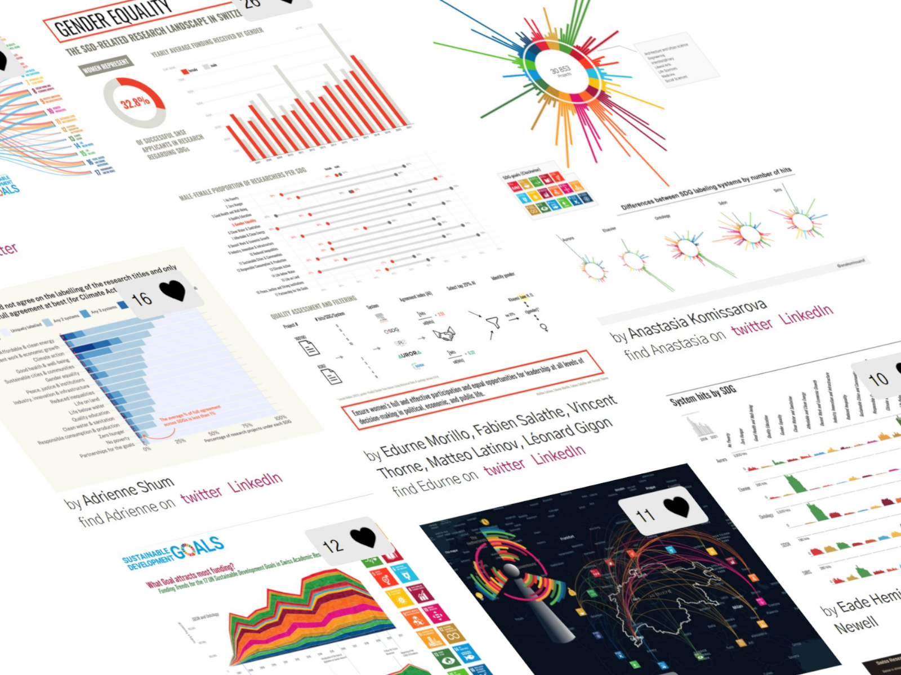

```{r general-setup, include=FALSE}
## This file contains the FRENCH version of the data story 

# Set general chunk options
knitr::opts_chunk$set(echo = FALSE, fig.showtext = TRUE, fig.retina = 3, 
                      fig.align = "center", warning = FALSE, message = FALSE)

# Install pacman package if needed
if (!require("pacman")) {
  install.packages("pacman")
  library(pacman)
}

# Install snf.datastory package if not available, otherwise load it
if (!require("snf.datastory")) {
  if (!require("devtools")) {
    install.packages("devtools")
    library(devtools)
  }
  install_github("snsf-data/snf.datastory")
  library(snf.datastory)
}

# Load packages
p_load(tidyverse,
       lubridate,
       scales, 
       conflicted, 
       jsonlite,
       here, 
       ggiraph)

# Conflict preferences
conflict_prefer("filter", "dplyr")
conflict_prefer("get_datastory_theme", "snf.datastory")
conflict_prefer("get_datastory_scheme", "snf.datastory")

# Increase showtext package font resolution
showtext_opts(dpi = 320)

# Set the locale for date formatting (Windows)
Sys.setlocale("LC_TIME", "French")

# Create function to print number with local language-specific format 
print_num <- function(x) snf.datastory::print_num(x, lang = "fr")

# Knitr hook for local formatting of printed numbers
knitr::knit_hooks$set(
  inline <- function(x) {
    if (!is.numeric(x)) {
      x
    } else {
      print_num(x)
    }
  }
)
```

```{r print-header-infos, results='asis'}
# Add publication date to header
cat(format(as_datetime(params$publication_date), "%d.%m.%Y"))

# Register the Google font (same as Data Portal, is not loaded twice)
cat(paste0("<link href='https://fonts.googleapis.com/css?family=", 
           "Source+Sans+Pro:400,700&display=swap' rel='stylesheet'>"))
```

```{r story-specific-setup, include=FALSE}
# Set story-specific variables etc. here

# E.g. loading data...

```

<!-- Short lead (2-3 sentences) in bold -->

__Le FNS publie une quantité importante de données sur les projets de recherche qu’il finance. Elles sont accessibles à tout le monde, que ce soit pour découvrir les tendances de la science ou pour explorer en profondeur des sujets spécifiques, comme par exemple la recherche sur le développement durable.__

En novembre 2021, un <a href="https://www.sdghackathon.io/" target="_blank">hackathon</a> sur la recherche suisse liée aux <a href="https://sdgs.un.org/goals" target="_blank">objectifs de développement durable (ODD) des Nations unies</a> a été organisé par <a href="http://www.correlaid.ch/" target="_blank">CorrelAid Switzerland</a> et le <a href="http://cds.unibas.ch/" target="_blank">Center for Cognitive and Decision Sciences de l’Université de Bâle</a>. Les participant·es ont analysé les données publiques liées aux recherches que finance le FNS, en se basant notamment sur les titres, les mots-clés, les résumés scientifiques et les disciplines de chaque projet, ainsi que sur les données démographiques de base des bénéficiaires. Ils ont ensuite développé des visualisations de données pour mettre en lumière divers aspects de la recherche menée sur les ODD en Suisse.

La meilleure visualisation, récompensée par le prix du jury d’expert·es, analysait le pourcentage de chercheuses contribuant à chaque ODD. Le prix du public a quant à lui été décerné à une visualisation qui illustrait combien de subsides chaque ODD recevait de la part des trois principaux domaines de recherche du FNS, et comment ces subsides se répartissaient entre les plus grandes universités de Suisse. Toutes les visualisations sont disponibles <a href="https://www.sdghackathon.io/hackathon-visualizations" target="_blank">ici</a>. 

De nombreux <a href="https://data.snf.ch/datasets" target="_blank">ensembles de données</a> peuvent être téléchargés sur le portail de données du FNS. Il s’agit notamment de résumés de projets, de publications et de résultats de recherche orientés vers l’application. Si vous faites des découvertes intéressantes à partir des données du FNS, nous serions très heureux que vous les partagiez avec nous !

<div class="plot-box">

<div class="hide-mobile hide-tablet" style="width: 800px;position: relative;max-width: 800px;left: -70px;border-top: 1px solid #d3d3d3;border-bottom: 1px solid #d3d3d3;padding-top: 20px;margin: 20px 0;">

<div class="plot-title">Extrait des visualisations élaborées lors du Hackathon ODD : visualiser la recherche suisse sur le développement durable</div>

```{r hackathon-gallery-desktop, out.width="100%", fig.height=6}

```

<div class="caption">
Extrait des visualisations soumises par les participant·es au Hackathon ODD : visualiser la recherche suisse sur le développement durable à partir des données ouvertes du FNS, <a href="https://www.sdghackathon.io/hackathon-visualizations" target="_blank">cliquez ici pour les voir toutes</a>.
</div>

</div>

<div class="hide-desktop">

<div class="plot-title">Extrait des visualisations élaborées lors du Hackathon ODD : visualiser la recherche suisse sur le développement durable</div>


```{r hackathon-gallery-mobile, out.width="100%", fig.height=6}

```

<div class="caption">
Extrait des visualisations soumises par les participant·es au Hackathon ODD : visualiser la recherche suisse sur le développement durable à partir des données ouvertes du FNS, <a href="https://www.sdghackathon.io/hackathon-visualizations" target="_blank">cliquez ici pour les voir toutes</a>.
</div>

</div>
</div>


Les données, le texte et le code de ce récit de données sont <a href="https://github.com/snsf-data/datastory_sustainability_hackathon" target="_blank">disponibles sur Github</a> et <a href="https://doi.org/10.46446/datastory.sustainability-hackathon" target="_blank">archivés sur Zenodo</a>. DOI: 10.46446/datastory.sustainability-hackathon